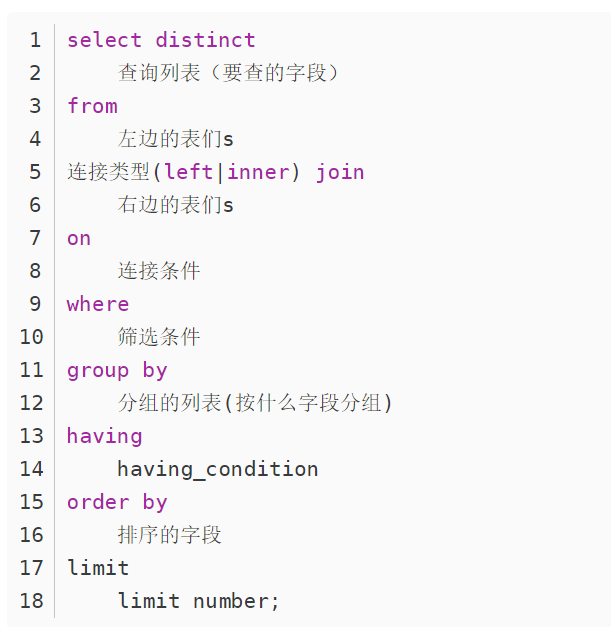
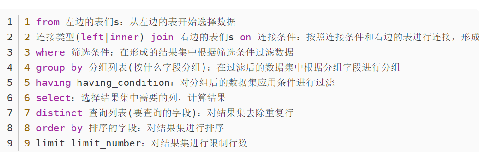

## SQL语句执行顺序

#####


#####


```sql
SELECT * FROM milk_tea;

SELECT prod_id, prod_name, 0.9 FROM milk_tea;

SELECT m.prod_name, m.in_price, m.sale_price * 0.9 AS new_sale FROM milk_tea AS m;

select m.prod_name, m.sale_price*0.5 as discount from milk_tea as m;
```


### 字段拼接，遇到空值NULL结果直接为空

```sql
SELECT m.*, CONCAT(prod_name, net_w) AS 产品信息 FROM milk_tea AS m;
select *, concat(prod_name, net_w) as 产品信息 from milk_tea;
SELECT m.*, CONCAT(prod_name, '(', sale_price, ')') AS 产品信息 FROM milk_tea AS m;
```


### CONCAT_WS表示以相同的拼接符拼接，自动过滤空值,拼接后原空值字段内容仍空；参数第一个表示字符，后面表示要拼接的内容

```sql
SELECT m.*, CONCAT_WS('是',prod_name,net_w,'单价',sale_price) AS 产品信息 FROM milk_tea AS m;
select *, concat_ws('-', prod_name, net_w, '单价', sale_price) as 产品信息 from milk_tea;
```


### 列中重复值去重

```sql
SELECT DISTINCT m.sale_price FROM milk_tea AS m;
select sale_price from milk_tea;
```


### 排序子句，对查询结果进行排序

```sql
SELECT * FROM milk_tea ORDER BY CONVERT(prod_name USING gbk);
select * from milk_tea order by convert(prod_name using gbk);
```


### 空值处理

```sql
SELECT * FROM milk_tea WHERE IFNULL(sale_price,15)=15;  
select * from milk_tea where ifnull(sale_price, 15)=15;
```


### 如果为空，就当成15进行计算，只是计算时不作为空值，实际表中空值并没有被填充; ifnull(expression, value) 检查表达式expression是否为空，如果为空则返回value

```sql
select * from milk_tea where IFNULL(sale_price,15)=15
SELECT * FROM milk_tea WHERE IFNULL(sale_price,0)*0.9<10;
```


### between and 是包含边界值的，not between不包括边界值

```sql
SELECT * FROM milk_tea WHERE in_price BETWEEN 5 AND 10;

SELECT * FROM milk_tea WHERE sale_price IS NULL;

SELECT * FROM milk_tea WHERE sale_price IS NOT NULL;

SELECT * FROM milk_tea WHERE NOT sale_price >=5 AND sale_price <=15;
select * from milk_tea where not sale_price >=5 and sale_price <=15;

SELECT * FROM milk_tea WHERE prod_name IN ('奶茶', '薯片', '棒棒糖');
select * from milk_tea where prod_name in ('奶茶', '薯片');
```


### 模糊查询，通配符的使用,_代表一个字符，知道具体的位置；而%可以代表多个字符或者空字符，知道大概位置

```sql
SELECT * FROM milk_tea WHERE prod_name LIKE '奶_';

SELECT * FROM milk_tea WHERE prod_name LIKE '%糖';
select * from milk_tea where prod_name like '薯_';
SELECT * FROM milk_tea WHERE sale_price BETWEEN 5 AND 15 AND prod_name LIKE '薯_';
```


### 聚合函数， count(1)和count(*)都包含null;

### count(1)会统计包括null值的所有符合条件的字段的条数。count(*)将返回表格中所有存在的行的总数包括值为null的行

```sql
SELECT COUNT(*) FROM milk_tea;
SELECT COUNT(1) FROM milk_tea;
select * from milk_tea
```


### count(列名)将返回表格中除去null以外的所有行的总数(有默认值的列也会被计入）

```sql
SELECT COUNT(DISTINCT sale_price) FROM milk_tea; 
```

### COUNT是唯一可以用*的聚合函数，不可以对多列进行计数.

```sql
SELECT SUM(sale_price) FROM milk_tea;

SELECT AVG(sale_price) FROM milk_tea;

SELECT MAX(sale_price) FROM milk_tea;

SELECT COUNT(1), SUM(sale_price), MAX(sale_price), MIN(sale_price), AVG(sale_price) FROM milk_tea;
```


### 分组数据 GROUP BY,对聚合键先过滤再聚合,过滤行

```sql
SELECT net_w, SUM(sale_price) FROM milk_tea WHERE net_w IN ('100g','150g') GROUP BY net_w; 
```

### 对聚合结果再次筛选得到分组，筛选组

### HAVING语句用于筛选分组聚合后的数据，只能在GROUP BY子句之后使用

### ORDER BY  xxx Limit  1 Offset 4是最后一条筛选语句

### limit x,y            #跳过x条数据读取y条数据

### limit y offset x #跳过x条数据读取y条数据

```sql
SELECT net_w, COUNT(*) 
FROM milk_tea 
WHERE net_w IN ('100g','150g') 
GROUP BY net_w 
HAVING COUNT(*)>=2 #having中是可以使用聚合函数的
ORDER BY net_w;
```


### 多表查询

### 标量子查询，返回的是一个值

```sql
SELECT sale_price FROM milk_tea WHERE prod_name = '奶茶';

SELECT * 
FROM milk_tea AS m 
WHERE m.sale_price > (
												SELECT sale_price 
												FROM milk_tea 
												WHERE prod_name = '奶茶');
												
select * from milk_tea as m where m.sale_price > (select sale_price from milk_tea where prod_name = '奶茶');
SELECT *, 
			(SELECT sale_price 
			FROM milk_tea 
			WHERE prod_name = '奶茶') as m
FROM milk_tea;

SELECT class, AVG(sale_price)
FROM prod_info
GROUP BY class
HAVING AVG(sale_price) > (SELECT sale_price 
												  FROM milk_tea 
												  WHERE prod_name = '奶茶');
```


### 关联子查询，嵌套在其他查询中的查询

### 不相关子查询

```sql
SELECT prod_name FROM milk_tea WHERE sale_price=15;
```

### 子查询结果为一列值时，可以作为不连续的取值放在IN条件中

```sql
SELECT * 
FROM milk_tea AS m
WHERE m.prod_name IN (SELECT prod_name 
											FROM milk_tea 
											WHERE sale_price=15);
```


### 子查询结果为一个表，可以作为子表进行查询

```sql
SELECT prod_name, type, sale_price FROM prod_info WHERE prod_name='抽纸';										
SELECT *
FROM (SELECT prod_name, type, sale_price 
			FROM prod_info 
			WHERE prod_name='抽纸') AS m
WHERE m.sale_price <=28;
```


### #相关子查询（查询本部门最高工资的员工）

### #相关子查询的执行依赖于外部查询。多数情况下是子查询的WHERE子句中引用了外部查询的表。

```sql
--方法一、通过不相关子查询实现，但是这种方式语句较多，具体有多少部分也未知
SELECT * FROM emp WHERE deptno = 10 and sal = (SELECT MAX(sal) FROM emp WHERE deptno = 10)
UNION
SELECT * FROM emp WHERE deptno = 20 and sal = (SELECT MAX(sal) FROM emp WHERE deptno = 20)
UNION
SELECT * FROM emp WHERE deptno = 30 and sal = (SELECT MAX(sal) FROM emp WHERE deptno = 30)
--方法二、相关子查询，子查询不可以独立运行，先运行外查询，再运行里面的
SELECT * FROM emp AS e WHERE sal = (SELECT MAX(sal) FROM emp WHERE deptno = e.deptno);
select * from emp as e where sal=(select max(sal) from emp where deptno=e.deptno);
SELECT * from emp as e where sal = (select max(sal) from emp where deptno = e.deptno);


--查询工资高于其所在岗位的平均工资的员工（相关子查询）
SELECT * FROM emp AS e WHERE sal > (SELECT AVERAGE(sal) FROM emp WHERE job = e.job);
```


### 表联结

### 内连接 INNER JOIN 返回交集数据行

### left join(左联接) 返回包括左表中的所有记录和右表中联结字段相等的记录，右表中匹配不上的字段用空值填充

### right join(右联接) 返回包括右表中的所有记录和左表中联结字段相等的记录，左表中匹配不上的字段空值填充

### 左连接 LEFT JOIN 返回匹配上的左表所有行，右表中没匹配上的返回null

### 右连接 RIGHT JOIN 返回匹配上的右表所有行，左表没匹配上的返回null

### 全连接 FULL JOIN  返回有交集的行和所有左右表没匹配上的行null

```sql
SELECT * FROM prod_info AS p;
SELECT * FROM supplier_info AS s;

SELECT p.*, s.*
FROM prod_info AS p, supplier_info AS s
WHERE p.supplier_id=s.supplier_id;

SELECT p.*, s.*
FROM prod_info AS p LEFT OUTER JOIN supplier_info AS s 
ON p.supplier_id=s.supplier_id;
```


### 组合查询UNION，多条SELECT语句用UNION联结起来，并且UNION有去重功能

### 最终的表头与第一张表一致，同样的数据类型才能够合并成一张表

```sql
SELECT * FROM order_list AS l WHERE l.order_id LIKE '20190407%'
UNION 
SELECT * FROM order_list AS l WHERE l.order_id LIKE '20190409%';
```


### 对关系型数据表的增删改

```sql
SELECT * FROM prod_info;
INSERT INTO prod_info VALUES(20003, '番茄味薯片', '乐事', '80g', '零食', 12.31, 18.30, 'NJ0002');
INSERT INTO prod_info(prod_id, prod_name, brand, type) VALUES(30005, '芬达', '百事', '饮料');
```


### 数据更新 ASC升序 DESC降序

```sql
SELECT * FROM prod_info ORDER BY prod_id ASC;

UPDATE prod_info
SET class = '休闲零食', sale_price = sale_price*0.9
WHERE class='零食';

SELECT * FROM prod_info;
```


### 数据删除

```sql
delete from prod_info where prod_id='30005';
SELECT * FROM prod_info;

DELETE FROM prod_info WHERE prod_name='抽纸'; #从表中删除一些数据

DELETE FROM prod_info;
#DELETE是可以带WHERE的,所以支持条件删除;而TRUNCATE只能删除整个表的内容
TRUNCATE TABLE prod_info;
```


### 表操作-创建表  字段名，数据类型，属性（属性主要包括是否允许NULL，默认允许；默认值DEFAULT设置，必须是常数）

```sql
CREATE TABLE pet1
(
	name VARCHAR(255) NOT NULL,
	owner VARCHAR(255) NOT NULL,
	species VARCHAR(255),
	sex CHAR(1),
	birth DATE,
	death DATE
);
CREATE TABLE PET1(
NAME VARCHAR(255) NOT NULL,
OWNER VARCHAR(255) NOT NULL,
SPECIES VARCHAR(255),
SEX CHAR(1),
BIRTH DATE,
DEATH DATE
);


SELECT * FROM pet1;
INSERT INTO pet1(name, owner, species, sex, birth, death) 
VALUES('pupy', 'Shirley', 'dog', 'F', 20160901, 20210120);

UPDATE pet1 SET name='pipy';
```


### 复制表

```sql
CREATE TABLE pet5
AS
SELECT * FROM pet2;
create table pet5 as (select * from pet2);
SELECT * FROM pet5;
```


### 删除表

```sql
DROP TABLE pet5;

CREATE TABLE pet5
AS 
SELECT name, owner FROM pet2;

SELECT * FROM pet5;
```


### 修改表，对表结构的修改，对字段的增删操作,修改数据类型

```sql
ALTER TABLE pet5 ADD sex CHAR(1);

ALTER TABLE pet5 ADD birth DATE NOT NULL;

ALTER TABLE pet5 DROP sex; # 或者可以用DROP COLUMN
SELECT * FROM pet5;

ALTER TABLE pet5 MODIFY COLUMN sex CHAR(2);
alter table pet5 modify column sex char(2);
ALTER TABLE pet5 modify COLUMN sex char(5)
```


### 对表进行更名

```sql
RENAME TABLE pet5 TO pet6;

DROP TABLE pet6;
```


### 视图本质上上是一个查询语句，是一个虚拟的不存在的表，它的内容是基于一个或多个表格的查询结果,修改视图会修改底层基表数据

### 视图是基于基表进行操作的，视图是每次查询时动态生成的虚拟表，不可以存储数据

### 视图可以简化复杂查询，如果要经常性地执行某项复杂查询，就可以基于这个复杂查询建立视图，以后查询此视图即可

### 如果创建的是只读视图可以提高数据安全性，给不同用户定制化显示数据

### 可以像操作表一样操作视图，视图如果设置了条件语句插入数据时可能不显示，但基表总是显示修改的

### 视图添加了检测条件with check option后如果数据不满足视图的条件时插入会报错

```sql
SELECT * FROM pet2; #视图的基表

--创建/替换（如果视图已经存在，就是替换或者说修改）单表视图
CREATE OR REPLACE VIEW pet_show
AS
SELECT * FROM pet2
WITH CHECK OPTION; #该语句表明如果插入不符合该条件的数据，就会报错，也即对视图修改增加数据时必须符合创建该视图时的where条件
create view pet_show  as select * from pet2 with check option;
--查看视图
SELECT * FROM pet_show;

--在视图中插入数据
INSERT INTO pet_show(name, owner, species, sex) VALUES ('pangpang', 'David', 'cat', 'F');
SELECT * FROM pet2; #实际的表中也被插入了数据


---创建/替换多表视图
CREATE OR REPLACE VIEW myview02
AS
SELECT e.empno, e.ename, e.sal, d.deptno, d.dname 
FROM emp AS e
JOIN dept AS d
ON e.deptno = d.deptno
WHERE sal > 2000


SELECT name, owner FROM pet_show WHERE sex='m';

DROP VIEW pet_show;
```


### 存储过程-实现模块化的程序设计，提高执行效率（定义时一次编译后续直接调用）

### 定义一个没有返回值的存储过程，实现模糊查询操作

```sql
SELECT * FROM pet2 WHERE name LIKE '%w%';
```

### 定义存储过程，类似一个函数包含函数名和参数

```sql
CREATE PROCEDURE mypro01(name1 VARCHAR(10))
BEGIN
  IF name1 IS NULL OR name1 ='' THEN
	   SELECT * FROM pet2;
  ELSE
	   SELECT * FROM pet2 WHERE name LIKE CONCAT('%', name1, '%');
 END IF;
END;
CREATE PROCEDURE MYPRO01(NAME1 VARCHAR(10))
BEGIN
IF NAME1 IS NULL OR NAME1 = '' THEN
SELECT * FROM PET2;
ELSE 
SELECT * FROM PET2 WHERE NAME LIKE CONCAT('%', NAME1, '%');
END IF;
END;
```


### 删除存储过程

```sql
DROP PROCEDURE mypro01;
DROP PROCEDURE MYPRO01;
```


### 调用存储过程

```sql
CALL mypro01(NULL);
CALL mypro01('a');

CALL test(12);
DROP PROCEDURE test;
```


### 定义一个有返回值的存储过程

### IN表示输入参数，可以省略；OUT 表示输出参数，FOUND_ROWS()作用返回查询结果的条数

```sql
CREATE PROCEDURE mypro02(IN name1 VARCHAR(10), OUT num int(3))
BEGIN
  IF name1 IS NULL OR name1 ='' THEN
	   SELECT * FROM pet2;
  ELSE
	   SELECT * FROM pet2 WHERE name LIKE CONCAT('%', name1, '%');
 END IF;
 SELECT FOUND_ROWS() INTO num;
END;

DROP PROCEDURE mypro02;


CALL mypro02(NULL, @num); #@区别了接收的结果参数
SELECT @num; #返回值通过这种形式可以查看

CALL mypro02('w', @aaa);
SELECT @aaa;
```


### 常用函数

```sql
SELECT ROUND(-1.55); #四舍五入函数
SELECT CEIL(-1.2); #向上取整
SELECT CEILING(-1.2); #向上取整
SELECT FLOOR(-1.2); #向下取整
SELECT TRUNCATE(-1.222436457,2); #截断，截取数字到小数点后两位
SELECT MOD(234,5); #相除取余
SELECT NOW(); #返回当前日期加时间
SELECT CURDATE(); #返回当前系统日期不包含时间
SELECT STR_TO_DATE('4#3-2021', '%m#%d-%Y'); #将字符串转化为日期
SELECT DATE_FORMAT(NOW(), '%m#%d#%Y'); #将日期转化为字符串
SELECT SUBSTR('ABCD', 2); #返回指定位置及其之后的字符串，索引从1开始
SELECT SUBSTR('ABCD', 1, 2); #从第一个字符开始截取两个字符
SELECT INSTR('ABCD','CD'); #返回第二个参数在第一个参数中第一次出现的位置（索引从1开始），若没有出现，返回0
SELECT TRIM('#'FROM'##3vjsv###'); #去除首尾指定字符，若不指定则表示去除空格
SELECT REPLACE('ABCD','BC','#') #替换所有指定字符串为另一个字符串
SELECT VERSION(); #获取sql版本号
SELECT USER(); #获取当前用户名
SELECT DATABASE(); # 获取当前所在数据库
SELECT ASCII('A'); # 返回字符的ASCII值
SELECT TRUNCATE(351.3253, 2); #从小数点右第二位截断
SELECT TRUNCATE(351.3253, -2); # 从小数点左第二位截断
```


### 流程控制函数

```sql
SELECT IF(10>5, '大', '小'); 
```

### CASE WHEN 用法

```sql
CASE

WHEN 条件1 THEN 要显示的值1或者语句1

WHEN 条件2   THEN 要显示的值2或者语句2

WHEN 条件3 THEN 要显示的值3或者语句3

ELSE  要显示的值x或者与语句x

END;
```

### 事务Transaction

### 事务是一个操作序列，该序列中的操作要么都做要么都不做，可以简化错误恢复使应用程序更加可靠

### 事务必须具备的ACID特性：原子性(Atomicity) 一致性(Consistency) 隔离性(Isolation) 持久性(Durability)

### #原子性是说事务中的所有操作同时成功或者同时失败回滚；一致性基于原子性，隔离性是其他事务的提交结果是否对当前事务可见；持久性是说事务一旦提交，对数据所做的任何改变，都要记录到永久存储器里

```sql
-----------------sql使用事务保证转账安全--------------------------
--创建账户表：
CREATE TABLE account(
	id INT PRIMARY KEY auto_increment,#主键一般使其为自增状态
	uname VARCHAR(10) NOT NULL,
	balance DOUBLE #账户余额
);
--查看账户表
SELECT * FROM account;
--在表中插入数据
INSERT INTO account VALUES (null, '丽丽', '2000'), (null, '小刚', '2000');
--丽丽给小刚转账200元
UPDATE account SET balance = balance-200 WHERE uname = '丽丽';
UPDATE account SET balance = balance+200 WHERE uname = '小刚';
---默认一个DML语句是一个事务，所以上面的操作执行了2个事务；必须使上面两个操作控制在一个事务中

--手动开启事务;
START TRANSACTION;
UPDATE account SET balance = balance-200 WHERE uname = '丽丽';
UPDATE account SET balance = balance+200 WHERE uname = '小刚';

--手动回滚，刚才执行的操作全部取消;后悔。
ROLLBACK;

--手动提交
COMMIT;
---在回滚和提交之前，数据库中的数据都是操作的缓存数据，而不是数据库中的真实数据
```

### 事务并发问题

### 1.脏读(Dirty read),另外一个事务读到了还未提交的数据

### 2.不可重复读(Unrepeatableread),如果另一个事务对数据的修改已经提交，就会导致第一个事务两次读取到的结果不一样

### 3.幻读；另一个事务（新增和删除）插入了数据，导致第一个事务发现多了原本不存在的记录 


### 事务隔离级别（解决事务并发问题）

### #隔离级别从低到高依次为 READ UNCOMMITTED读未提交 ; READ COMMITTED读提交, REPEATABLE READ（可重复读，事务执行时基于快照默认级别，一般用这个）; SERIALIZABLE(串行化，事务执行时对数据加锁，其他事务无法访问或者修改数据，一般不用，性能最差)

```sql
--查看默认的事务隔离级别
SELECT @@TRANSACTION_ISOLATION;
--设置事务的隔离级别（设置当前会话的隔离级别）
SET SESSION TRANSACTION ISOLATION LEVEL READ UNCOMMITTED;
SET SESSION TRANSACTION ISOLATION LEVEL READ COMMITTED;
SET SESSION TRANSACTION ISOLATION LEVEL SERIALIZABLE;

START TRANSACTION;
SELECT * from account WHERE id=1;
```

### sql数据库表设计满足三大范式

第一范式(确保每列保持原子性)

第二范式(确保表中的每列都和主键相关)

第三范式(确保每列都和主键列直接相关,而不是间接相关)

### sql索引

**索引的原理**

以空间换时间，数据库在未添加索引的时候进行查询默认的是进行全量搜索，也就是进行全局扫描，有多少条数据就要进行多少次查询，然后找到相匹配的数据就把他放到结果集中，直到全表扫描完。而建立索引之后，会将建立索引的KEY值放在一个n叉树上（B+Tree）。因每次以索引进行条件查询时，会去树上根据key值直接进行搜索，次数约为log总条数，但是全量搜索为100万次搜索，这种方式类似于二分法，但是这个是n分法。

B+树改进了B树, 让内结点只作索引使用, 去掉了其中指向data record的指针, 使得每个结点中能够存放更多的key, 这样就意味着存放同样多的key, 树的层高能进一步被压缩, 使得检索的时间更短. 

B+树叶⼦节点存储了所有数据并且进⾏了排序，并且叶⼦节点之间有指针，可以很好的⽀持全表扫描，范围查找等SQL语句

**什么是索引**

索引指数据库的目录，比如：字典上面的字母目录 (适用于大数据量)

**建立索引的优缺点**

优点: 查询速度快

缺点: 增删改慢，因为数据库要同步去维护索引文件，所以速度慢

**索引有什么分类？**

1. 主键索引：名为primary的唯一非空索引，不允许有空值。
2. 唯一索引：索引列中的值必须是唯一的，但是允许为空值。唯一索引和主键索引的区别是：UNIQUE 约束的列可以为null且可以存在多个null值。UNIQUE KEY的用途：唯一标识数据库表中的每条记录，主要是用来防止数据重复插入。创建唯一索引的SQL语句如下：
3. 组合索引：在表中的多个字段组合上创建的索引，只有在查询条件中使用了这些字段的左边字段时，索引才会被使用，使用组合索引时遵循最左前缀原则
4. 全文索引：只有在MyISAM引擎上才能使用，只能在CHAR,VARCHAR,TEXT类型字段上使用全文索引。

**索引检索为什么快**

索引结构：B+Tree

**聚集索引（主键索引）和非聚集索引（非主键索引）的根本区别是表记录的排列顺序和与索引的排列顺序是否一致；聚集索引存储记录是物理上连续存在，而非聚集索引是逻辑上的连续，物理上并不连续**

**为什么主键索引查询更快呢**

因为主键索引树的叶子节点直接就是我们要查询的整行数据了。而非主键索引的叶子节点是主键的值，查到主键的值以后，还需要再通过主键的值再进行一次查询，这个过程称为回表

**非主键索引一定会查询多次吗？**

可以使用覆盖索引来减少查询次数

当sql语句的所求查询字段（select列）和查询条件字段（where子句）全都包含在一个索引中（联合索引），可以直接使用索引查询而不需要回表。这就是覆盖索引

**索引的优点：**

① 建立索引的列可以保证行的唯一性，生成唯一的rowId

② 建立索引可以有效缩短数据的检索时间

③ 建立索引可以加快表与表之间的连接

④ 为用来排序或者是分组的字段添加索引可以加快分组和排序顺序

**索引的缺点：**

① 创建索引和维护索引需要时间成本，这个成本随着数据量的增加而加大

② 创建索引和维护索引需要空间成本，每一条索引都要占据数据库的物理存储空间，数据量越大，占用空间也越大（数据表占据的是数据库的数据空间）

③ 会降低表的增删改的效率，因为每次增删改索引需要进行动态维护，导致时间变长

**一般你们会在什么情况下加索引**

频繁作为查询条件的字段应该创建索引

查询中与其他表关联的字段，外键关系建立索引

查询中排序、分组的字段

**怎么知道索引用没用上**

通过explain查询sql执行计划，在要查询的语句前面加上explain plan for 

**用过组合索引吗，是有序的吗**

用过， 有序(最左原则)

**什么情况下会使索引失效？**

（1）like

（2）like “%123%，前面不能+%

（3）使用 关键字 in ，or ，null，!=

**sql优化您们是怎么做的？**

一.首先开启数据库慢查询日志，定位到查询效率比较低的sql , 找出对应的sql语句并进行分析

1.**表设计**是否规范，是否符合三范式的标准

（1）第一范式：保证原子性（不可拆分）字段的原子化是指一个字段里不要包括多个同类型的值

（2）第二范式：每一列都有主键相关

（3）第三范式每一列与主键直接相关而不是间接相关，减少冗余字段的约束

2.查看数据表中是否存在大量的冗余字段，字段数据类型是否合理

3.尽可能的使用varchar代替char 建表数据类型，能用数值的绝对不用字符存储

4.尽量避免null值，使用默认值替代空值，数值型可以使用0，字符型可以使用空字符串

二.查看sql语句是否规范

（1）避免使用关键字：or ，in，not in ，!=，<>，避免使用select *

（2）尽量避免子查询，大部分子查询都可以连接查询

（3）用到or的地方可以使用union去代替实现

（4）用到in的地方可以使用exists去代替

三.分析sql的索引是否可以用上

（1) explain查询sql的执行计划,重点关注的几个列就是，type是不是全表扫描

（2）看一下索引是否能够用的上,主要看key使用的是哪个索引

（3）看一下rows扫描行数是不是很大

四.可以使用存储过程，减少编译时间

**Null和空值的区别，如何提取出来**

空值在SQL中不占内存空间,而NULL值会分配内存空间

SQL中Count()求和,对NULL值会自动忽略而空值会记录一笔资料.

定义为NOT NULL的字段只能插入空值，不能插入null值，而NULL字段可以插入空值，也可以插入null值

判断NULL 用IS NULL 或者 is not null,SQL 语句函数中可以使用ifnull()函数来进行处理，判断空字符用 =”或者 <>”来进行处理

当使用ORDER BY时，首先呈现NULL值。如果你用DESC以降序排序，NULL值最后显示。当使用GROUP BY时，所有的NULL值被认为是相等的，故只显示一行。

**count(1)、count(\*)和count(字段名)执行效果上的区别**

count(*)包括了所有的列，相当于行数，在统计结果的时候，不会忽略列值为NULL

count(1)包括了忽略所有列，用1代表代码行，在统计结果的时候，不会忽略列值为NULL

count(列名)只包括列名那一列，在统计结果的时候，会忽略列值为空（这里的空不是只空字符串或者0，而是表示null）的计数，即某个字段值为NULL时，不统计。

 

 

**大表查询慢如何解决**

1、 合理建立索引，通常查询利用到索引比不用索引更快；

2、 通过分库分表的方式进行优化，主要有垂直拆分和水平拆分。对关键字段建立水平分区，比如时间字段，若查询条件往往通过时间范围来进行查询，能提升不少性能；

3、 根据查询建立对应的表，定时对重复的记录进行压缩转存至新表，粒度变大，数据记录变少**。**在表的命名上体现查询条件增加查询速度

4、 读写分离： 经典的数据库拆分方案，主库负责写，从库负责读；


#### 经典sql问题

#### 每个分组中连续出现N次的问题

涉及到每个，要想到用分组或者窗口函数，例如：

```sql
select *,
       rank() over(partition by 球队 
                   order by 得分时间) as 排名
from 分数表;
```

如何用SQL实现上述错位两列的效果呢？

可以用窗口函数**lag或者lead：**

> 向上窗口函数lead：取出字段名所在的列，**向上**N行的数据，作为独立的列
>
> 向下窗口函数lag：取出字段名所在的列，**向下**N行的数据，作为独立的列


窗口函数语法如下：

> lag(字段名,N,默认值) over(partion by …order by …)
>
> lead(字段名,N,默认值) over(partion by …order by …)


默认值是指，当向上N行或者向下N行值时，如果已经超出了表行和列的范围时，会将这个默认值作为函数的返回值，若没有指定默认值，则返回Null。

例如，要求连续出现三次的值，分别得到向上偏移一行和两行的列

```sql
select 球员姓名,       
lead(球员姓名,1) over(partition by 球队 order by 得分时间) as 姓名1,       
lead(球员姓名,2) over(partition by 球队 order by 得分时间) as 姓名2
from 分数表;
```

```sql
select distinct 球员姓名
from(
    select 球员姓名,
    lead(球员姓名,1) over(partition by 球队 order by 得分时间) as 姓名1,
    lead(球员姓名,2) over(partition by 球队 order by 得分时间) as 姓名2
    from 分数表) as a
where (a.球员姓名 = a.姓名1 and a.球员姓名 = a.姓名2);
```


另一种解法，参考力扣180题：新增一列使num列分区按照id排序；和id列序号相减的差相等说明是连续出现的数

```sql
select distinct a.num ConsecutiveNums
from 
(
    select *, (row_number() over(order by id) - row_number() over(partition by Num order by id)) as minus 
    from Logs 
) a 
group by a.Num, a.minus 
having count(*)>=3;
```

